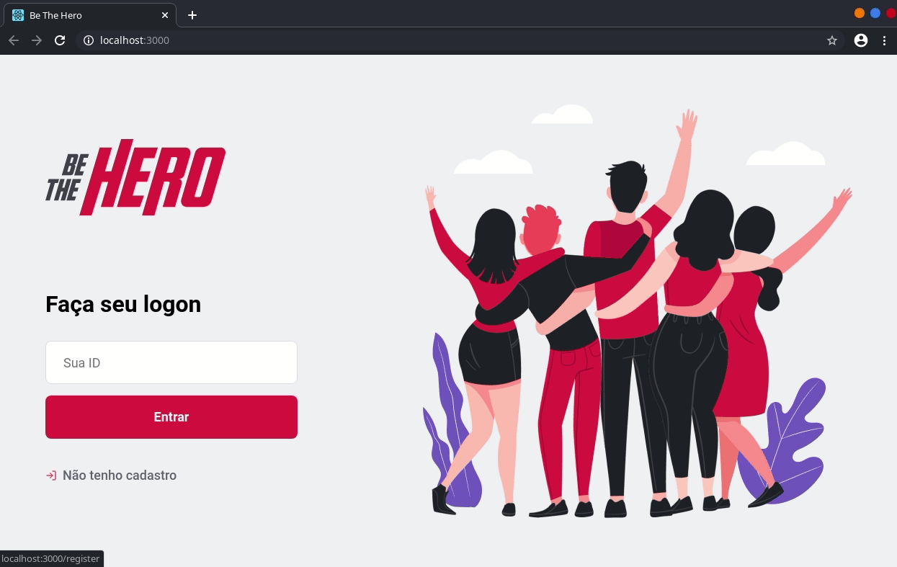
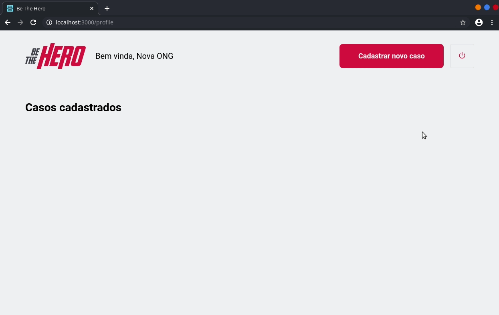

# 

Aplicação web para conectar ONGs com pessoas que querem ajudar financeiramente um determinado caso! Essa aplicação foi desenvolvida durante a semana Omnistack 11.0, promovida pela Rocketseat e ministrada por [Diego Fernandes](https://github.com/diego3g).

## Descrição

De forma simples, a ideia é que as ONGs se cadastrem através da aplicação Web, e publiquem os casos em que precisam de ajuda. As pessoas com disponibilidade para ajudar podem olhar os casos através da aplicação mobile, onde poderão entrar em contato com a ONG. [Veja seção de funcionalidades](#funcionalidades)

## Principais tecnologias

* **Backend**: Uma API utilizando Node.js foi desenvolvida. Para integração com o banco de dados, utilizou-se SQLite, e a biblioteca Knex.js como query builder. Alguns conceitos de testes unitários e de integração foram praticados para algumas rotas com as bibliotecas Jest e supertest .
* **Frontend**: ReactJS.
* **Mobile**: React Native e Expo.

## Screenshots

### Cadastro
Tela inicial e cadastro de uma nova ONG na aplicação Web.

### Registrar casos
Registrando um novo caso na aplicação Web.

### Ajudar em um caso

Demonstração do mobile app. O usuário pode entrar em contato via email ou whatsapp.

